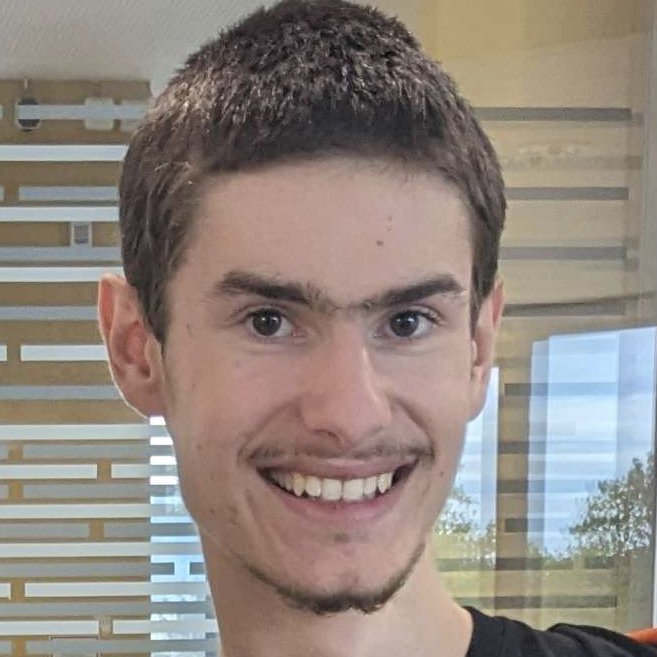
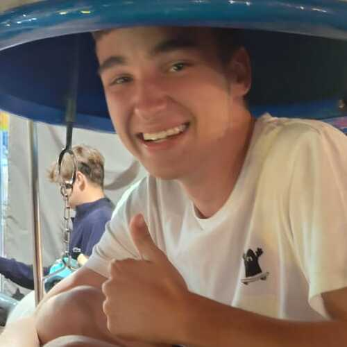
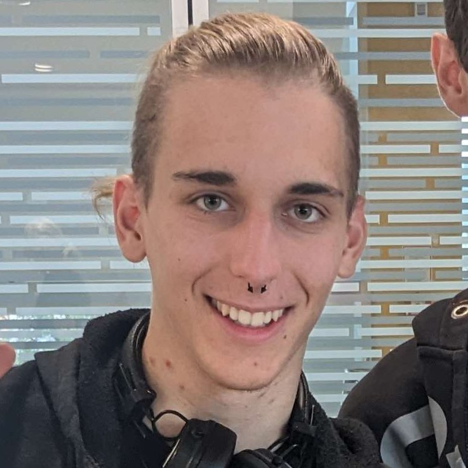
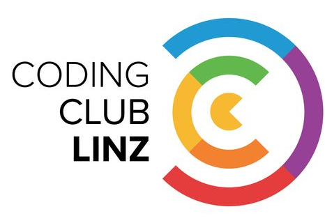
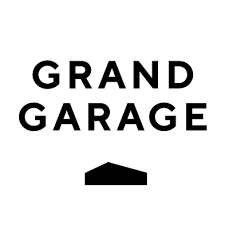

# Linux-FOSS Linz #1

---

### Jakob Hofer

### Lorenz Holzbauer

### Michael Stenz

---

### Robert Führicht

Platform Engineer
@ uni software plus

**Automatic Backups using Borgmatic**

### Daniel Knittl-Frank

Software-Engineer

**Episode VIM - Return of the editor**

---

## Schedule
-  **18:30 - 19:15**: Talk #1 - Backups by Robert Führicht
-  **19:15 - 19:30**: Questions & Break
-  **19:30 - 20:15**: Talk #2 - Vim by Daniel Knittl-Frank
-  **20:15 - open end**: Questions, Networking, ...

---

## Drinks

- Call us so we can hold the card onto the sensor
- Enjoy your drink!

---

## Sponsors

### Coding Club

### Grand Garage

---

# alles-digital.org

<!-- _backgroundColor: "#ffffff" -->
<!-- _color: "#000000" -->

Everything digital for our customers. That is our mission. Not somehow, but in the most efficient way and with the best possible result - a successful and sustainable digital business model.

---

# Discord Server

https://discord.gg/vxgBuVVcbt

---

## Photos

We'd like to take photos during the event for Social Media.

If anyone doesn't want to be on the photos, please tell us!

---

## Call for Speakers
- anything Linux / FOSS related
- beginners welcome!

https://sessionize.com/linux-foss-linz-meetup/

---

## Call for Hosts
- Hosts provide the location
- ideally: food as well
- also talk to your employer!

linuxfosslinz@proton.me
